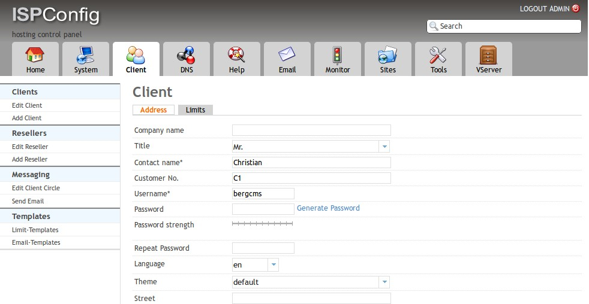
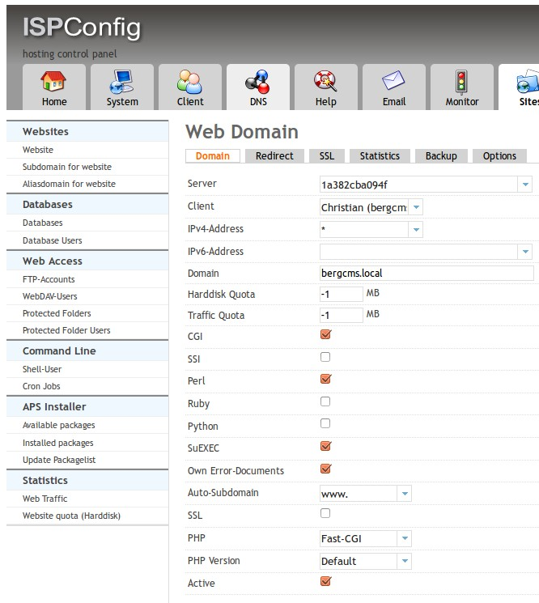
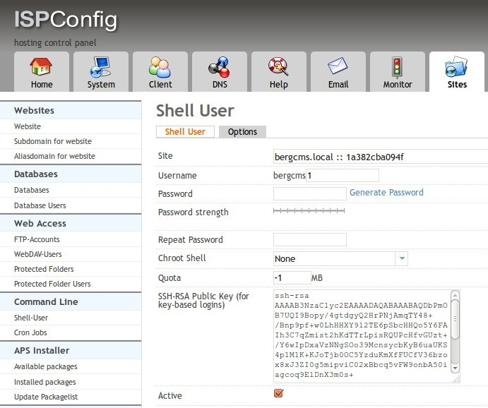
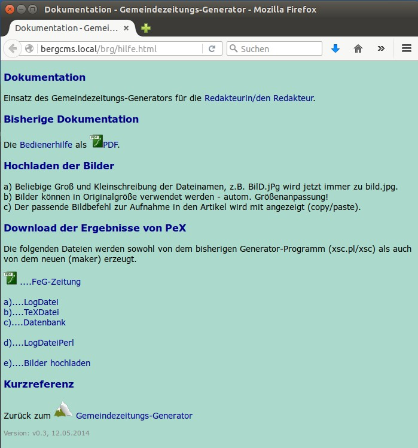
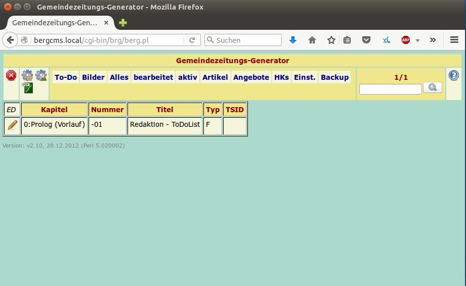
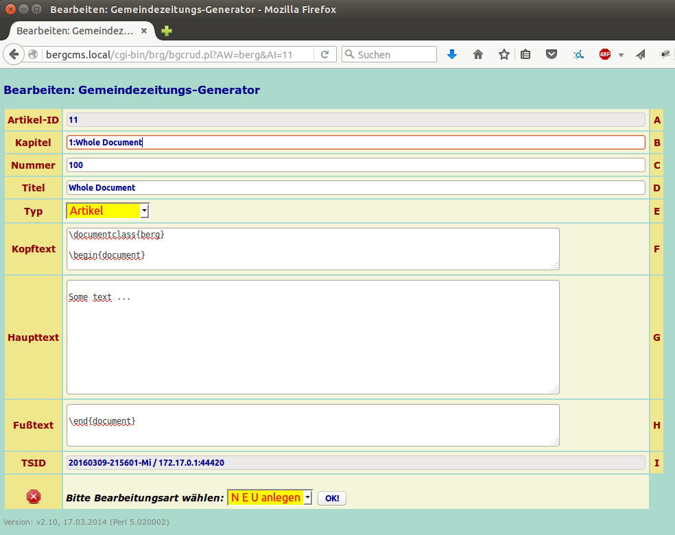
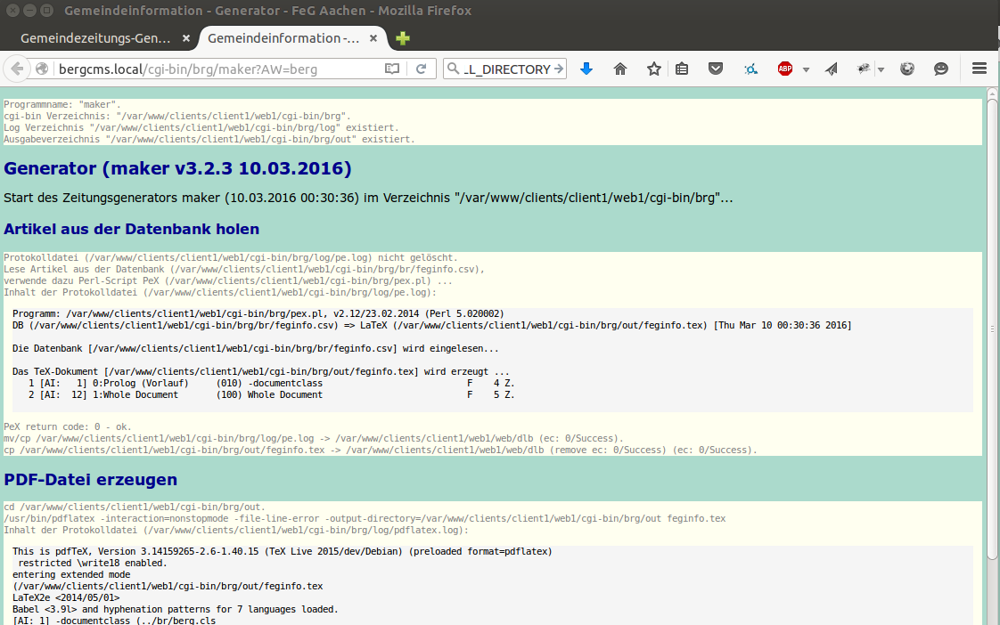
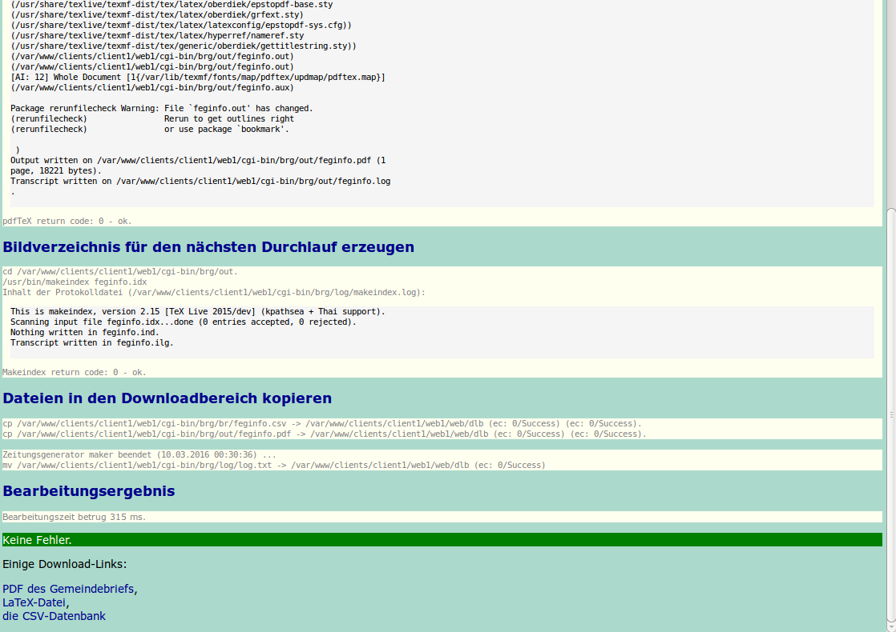
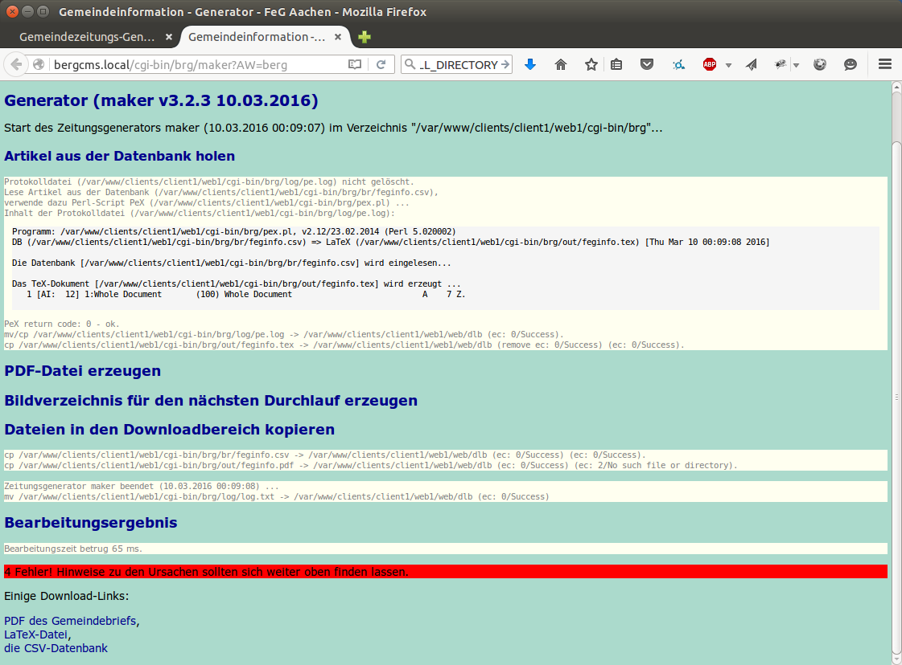

# Installing the Berg CMS on a hoster providing ISPConfig

## Build and start the docker image with the ISPConfig

This demo is performed using a Docker image with ISPConfig 3.0.5. The
installation of docker was performed according to
[https://docs.docker.com/engine/installation/linux/ubuntulinux/](https://docs.docker.com/engine/installation/linux/ubuntulinux/).

To get a Docker image with ISPConfig, see
https://hub.docker.com/r/jerob/docker-ispconfig/

    $ docker pull jerob/docker-ispconfig

After some time the image is build and we can start the container.
The first command will expose all of services:

    $ docker run --name ispconfig  -e MAILMAN_EMAIL_HOST=test.com -e MAILMAN_EMAIL=test@test.com -e MAILMAN_PASS=pass -d -p 20:20 -p 21:21 -p 30000:30000 -p 30001:30001 -p 30002:30002 -p 30003:30003 -p 30004:30004 -p 30005:30005 -p 30006:30006 -p 30007:30007 -p 30008:30008 -p 30009:30009 -p 80:80 -p 443:443 -p 8080:8080 -p 53:53 -p 2222:22 jerob/docker-ispconfig /start.sh

The following command focuses more on providing access to the sshd and apached:

    $ docker run --name ispconfig  -e MAILMAN_EMAIL_HOST=test.com -e MAILMAN_EMAIL=test@test.com -e MAILMAN_PASS=pass -d -p 20:20 -p 21:21 -p 30000:30000 -p 30001:30001 -p 30002:30002 -p 30003:30003 -p 30004:30004 -p 30005:30005 -p 30006:30006 -p 30007:30007 -p 30008:30008 -p 30009:30009 -p 80:80 -p 443:443 -p 8080:8080 jerob/docker-ispconfig /start.sh

584065694b3a065eca5b49da568a4b138c6cb09cbcf64a33792c65b20991a32f

## Connect to ISPConfig

At the beginning the administration interface was opened on
https://localhost:8080 using the standard passwords admin/admin.

## New Client

Initially a new Client with username bergcms was added.

## New Web Domain aka new Website

For this client a new web site was added, too.

Domain bergcms.local

Enable CGI, Perl, SuEXEC

## New Shell User

Finally a new shell user was added to the client.

New shell user:
username bergcms1 (the shown user name is added to the main user name!?)

./var/log/ispconfig/httpd/bergcms.local
./var/www/bergcms.local
./var/www/clients/client1/bergcms.local
./var/www/clients/client1/web1/home/bergcms1
./var/www/clients/client1/web1/home/bergcmsbergcms
./etc/apache2/sites-enabled/100-bergcms.local.vhost
./etc/apache2/sites-available/bergcms.local.vhost.err
./etc/apache2/sites-available/bergcms.local.vhost

mkdir /var/www/bergcms.local/web/brg /var/www/bergcms.local/cgi-bin/brg

realdir is:
HTDOCS /var/www/clients/client1/web1/web and
CGI-BIN  /var/www/clients/client1/web1/cgi-bin

# Getting the Berg CMS up and running as a user of ISPConfig

## Getting the system

Clone or download the latest source from
https://github.com/leutloff/berg

There are already pre build releases available for Ubuntu 64-bit and 32-bit and
Debian 64-bit.

For this demonstration the Debian Jessie Archive (Berg-3.2.3-x86_64-GNU-e5c68db50333.zip) is
downloaded from  https://github.com/leutloff/bergcms-build-debian/releases

Unzip the archive and deploy it to the remote site.

    $ curl -LOk https://github.com/leutloff/bergcms-build-debian/releases/download/v3.2.3/Berg-3.2.3-x86_64-GNU-e5c68db50333.zip
    $ unzip Berg-3.2.3-x86_64-GNU-e5c68db50333.zip
    $ cd Berg-3.2.3-x86_64-GNU-e5c68db50333

## Configure the Deployment Script

In this directory there are two shell script. `deploy.sh` is for use with FTP
access to the web space and `deploy_ssh.sh`.

To show the help of the deploy script just start it:

   $ ./deploy_ssh.sh

Now it's time to create a file named `remotehosts.cfg` to provide the required
information where to store the files. I expect that the following variables must
be provided:

| Variable Name   | Description    |
| :-------------  | :------------- |
| DEPLOYTO        | user@hostname, e.g. bergcms1@bergcms.local              |
| HTDOCSDEPLOYDIR | Absolute directory where the static content is placed.  |
| CGIBINDEPLOYDIR | Absolute directory where the CGI programs are expected. |

Example using the same values as originally in the script:

    # remotehosts.cfg
    DEPLOYTO=bergcms1@bergcms.local
    HTDOCSDEPLOYDIR=/var/www/clients/client1/web1/web/brg
    CGIBINDEPLOYDIR=/var/www/clients/client1/web1/cgi-bin/brg

## Deploying the Static Content

Now all or selected parts of the Berg CMS can be deployed to the remote web
server. I suggest to start with the static html:

   $ ./deploy_ssh.sh -c htdocs

Check the installation by opening the URL http://bergcms.local/brg/hilfe.html
It may be necessary to adapt the beginning of the URL to the local requirements.

## Deploying the Perl based CGI scripts

Next are the Perl scripts to select and edit the articles.

    $ ./deploy_ssh.sh -c libs
    $ ./deploy_ssh.sh -c perl

Again, test it by opening the entry page to the articles:  
http://bergcms.local/cgi-bin/brg/berg.pl

Now it should be possible to add some articles by clicking on the edit symbol in
the ED column.

## Deploying the C++ based CGI programs

Last step is to add the programs responsible for generating the final PDF files.

    $ ./deploy_ssh.sh -c servers
    $ ./deploy_ssh.sh -c latex

Just click on the mountain symbol or open the URL
http://bergcms.local/cgi-bin/brg/maker

The Generator `maker` extracts the articles from the database and stores them in
a LaTeX file. The rendering of the PDF is started.

Finally an index of the images generated and then the files are copied into the
download area.

## Next releases

The next releases can then easily deployed all at once:

    $ ./deploy_ssh.sh -c all

# Troubleshooting

## ERROR 500

Opening the C++ based CGI program
http://bergcms.local/cgi-bin/brg/maker
just returns a 500 internal error page.

Goto the location in the file system and try the ldd on the executable:

    $ cd /var/www/clients/client1/web1/cgi-bin/brg
    $ ldd maker

If any library ends with `=> not found` the missing library must be provided.

## LaTeX is missing

At the moment a missing LaTeX is shown a missing output, only. It will be an
output similar to the following one.

One solution is to install LaTeX at the system level, e.g.

    $ sudo apt-get install --no-install-recommends texlive-latex-base texlive-latex-recommended texlive-latex-extra texlive-lang-german texlive-fonts-recommended texlive-fonts-extra fonts-linuxlibertine latex-xcolor

This results in a 300 MB download and 870 MB additional disk usage - reported on
the installation.
